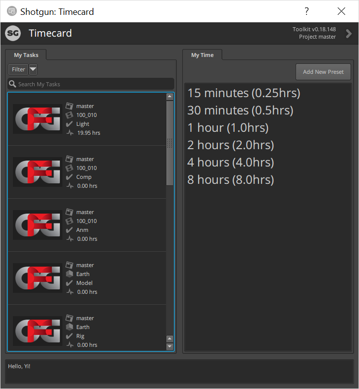
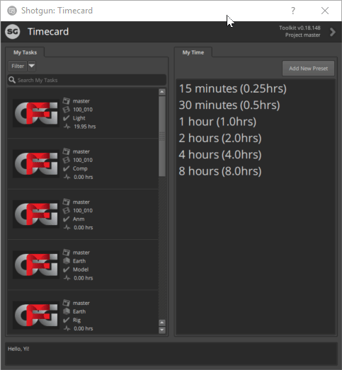
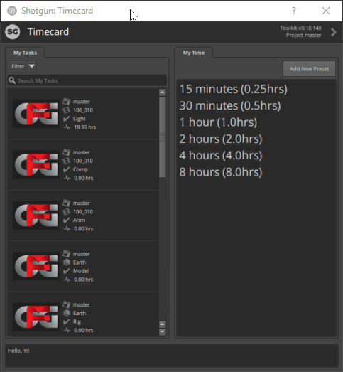
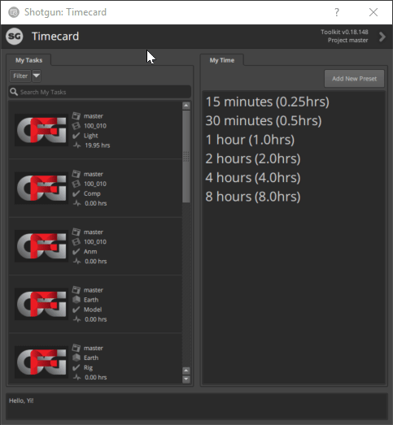
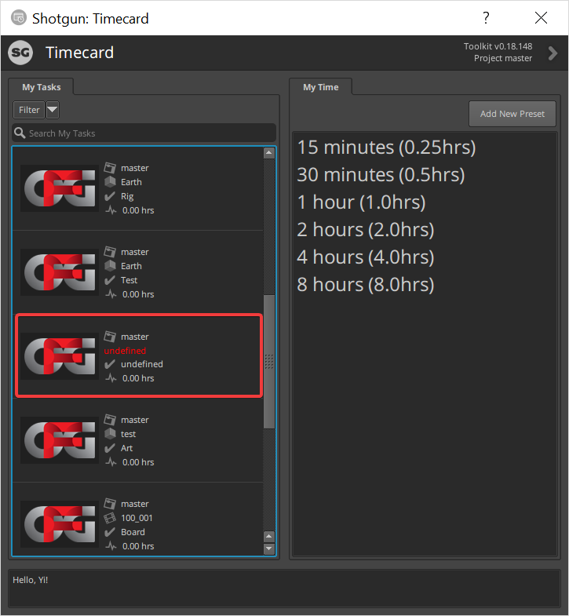

# Shotgun Timecard

## Introduction
Timecard App is a lightweight Shotgun Desktop App that allows users to log their work time to Shotgun easily.

## Interface
There basically two parts of this app
 * My Tasks - showing your task
 * My Time - time presets



## Usage
You can either drag&drop a time preset to a task or right click a task to log your time.




## Filter and Search
You can also use filter or search function to help you find your task




## Configurations
```
    my_tasks_filters:
      type: list
      description: List of filters to apply to the tasks in the My Tasks tab.
      values:
        type: shotgun_filter
      allows_empty: True
      default_value:
        - [task_assignees, is, '{context.user}']

    my_tasks_extra_display_fields:
      type: list
      description: List of additional fields to display with the task in the My Tasks list.
      values:
        type: str
      allows_empty: True
      default_value: []
```

## Known Isssue
If some tasks are not link to any entities, they will show up as red “undefined”.
You cannot create any timelog on this task.



## Upcoming Features
* The bottom text field will show more information to users (e.g. “Timelog submitted successfully”, “invalid task” )
* Ability to track working time and create time presets automatically

## License
SHOTGUN PIPELINE TOOLKIT SOURCE CODE LICENSE